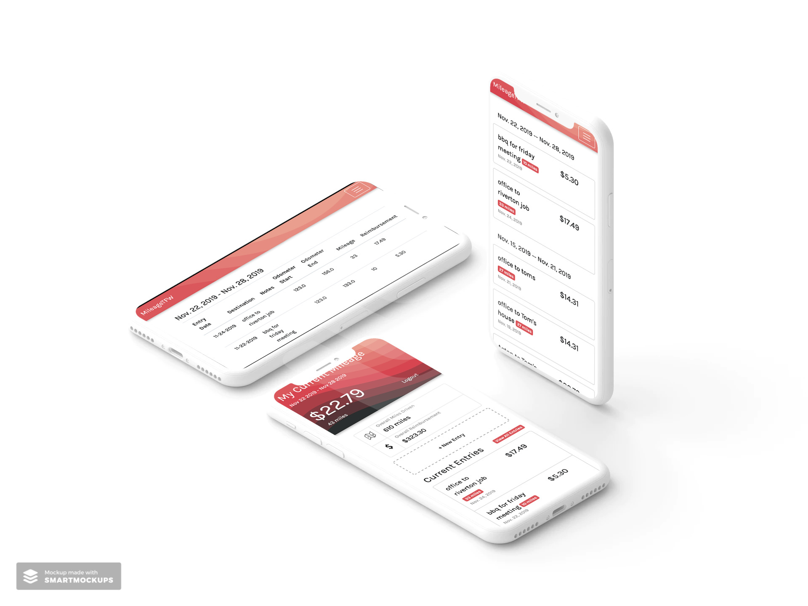

# Mileage TFW
[www.mileage.thefoundationworks.com](http://www.mileage.thefoundationworks.com)

The idea for this project came to me when I very first started working for The Foundation Works. When working in the field we would often switch job sites during the work day and we could get reimbursed for mileage. In order to get reimbursed for our mileage we would have to create a spreadsheet every week and send it to accounting every week.

Frankly, it was kind of a pain in the neck to track miles via a new spreadsheet every week.

So I set out to solve that. This app enables me and other employees to accurately and easily track our miles. It automatically takes the entries and generates a spreadsheet, and then emails it accounting every week.

Out of all the apps I made while at The Foundation Works, this app is the most used and is used nearly every day by myself and others.

# The Tech

This app is fairly simple and is built on **Django** and is served by **Gunicorn** and **Nginx**. The app uses **Celery** to email the spreadsheets to accounting every week. The Celery process are managed by **systemd**. The spreadsheets are generated using **openpyxl**.

